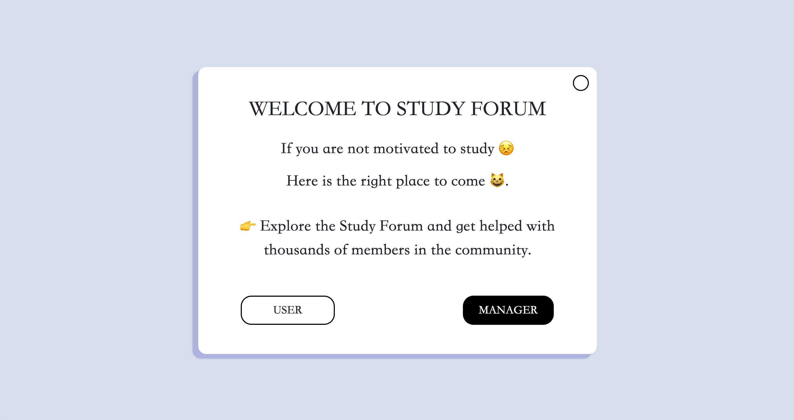
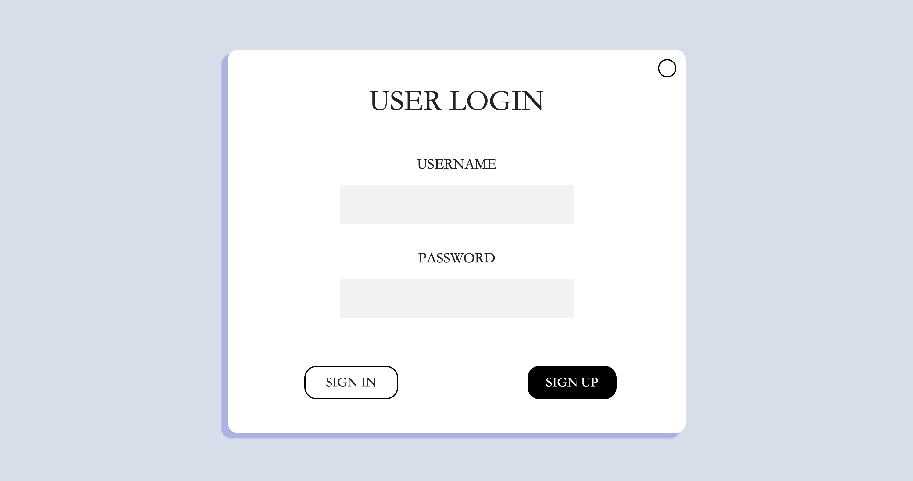
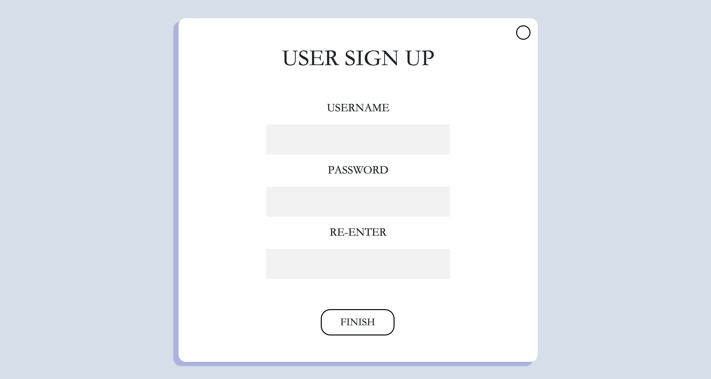
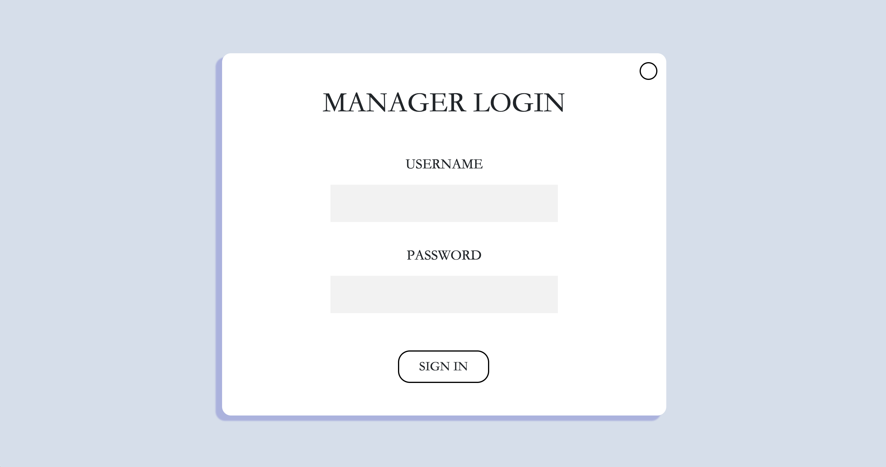
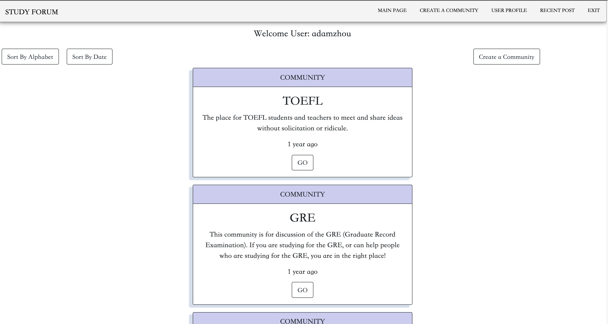
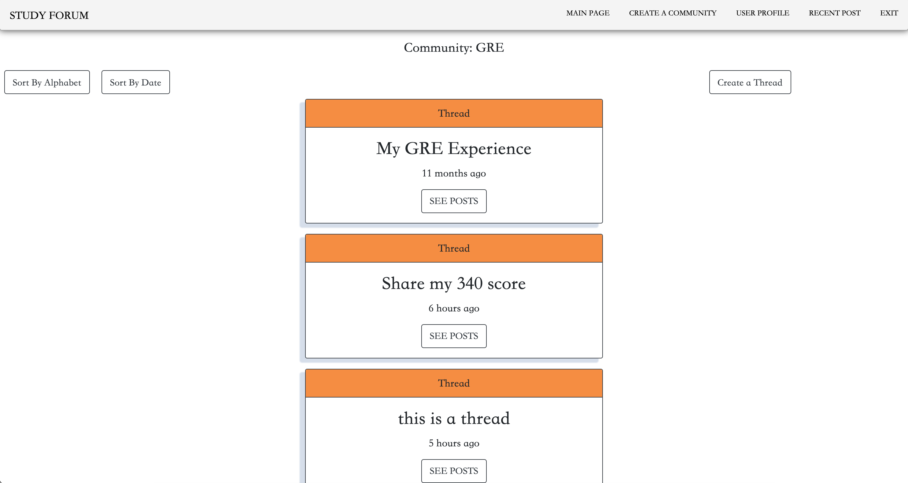
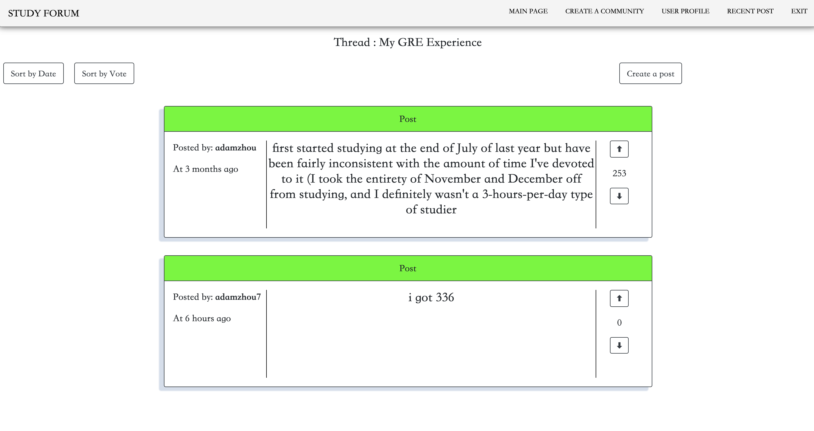
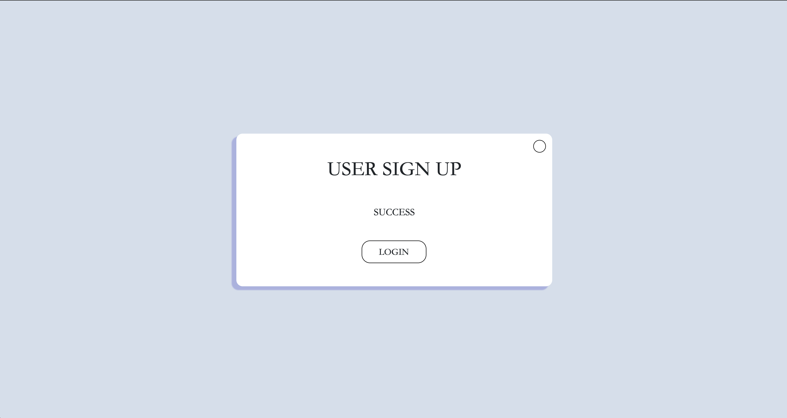
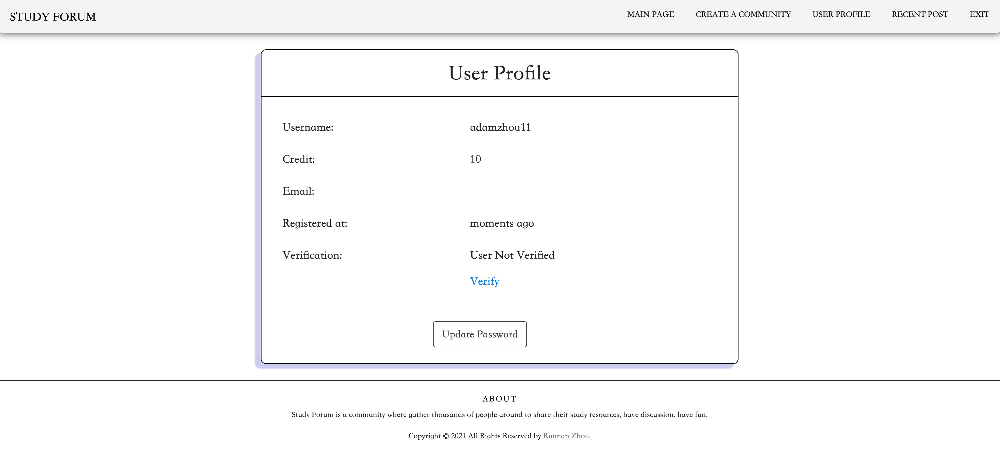
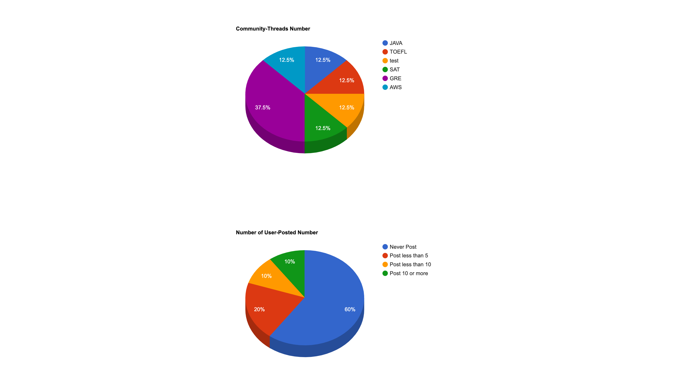

# StudyingForum

# Please give a Star if this help! Any questions in issues will be answered. Thank you!

1.	Summary
This application is a forum application which provide a platform for users to share and help each other on specific field. The purpose is to help people get improved on their study. The organization of content can be divided into three parts. Communities, Threads, Posts. Communities is to set the topic of the discussion happened in the communities. We have communities for various fields of study. For example, GRE, SAT, TOFEL communities.  For each community, there are several threads in it. The threads set a more specific area for the discussion. Such as, share the experience of studying or ask questions about a specific topic. For each thread, there are several posts. Each post is to convey the information by the user.
2.	Functionality Performed   
•	Sign in/Sign up/ Update password of user.  
•	Create community/thread/post.  
•	Retrieve community/thread/post.  
•	delete community/thread/post.  
•	Upvote, downvote of a thread/post.  
•	Retrieve user recent posts.   
•	Compute the duration for community/thread/post. Such as “posted 5 minutes ago” or “posted one month ago”.  
•	Community /thread/ post sort functionality based on timestamp, alphabet, number of votes   
•	Pagination of user post. Compatible with sort functionality.  
•	User verification (Send Email and code match).  
•	User’s profiles look up by manager.  
•	User’s posts look up by manager.  
•	Award user credit.  
•	Deduct user credit.  
•	Generate report based on statistics (Compute the data dynamic and display with Google pie chart)   
3.	Technologies.  
•	Spring MVC.  
•	ORM Hibernate.  
•	MySQL.  
•	AJAX.  
•	CSS/Bootstrap.  
•	Tomcat   
•	Libraries: Google Pie Chart, prettyTime, Jackson, JavaMail,Junit.  

4.	Roles and Tasks.  
• User Role: 
Create Community/thread/post.  
Upvote and downvote thread/post.  
Communicate with other members in the forum.  
Verify the email address.  
Update user profile.  
Look up other users’ profile.  
Check recent post.  
Check community/thread/post by date, alphabet, number of votes.  
• Manager Role:   
delete Community/thread/post.  
User profiles look up   
User posts look up.   
Award/deduct user credit.  
Generate report about the forum user’s information.  

# Screen Shots

